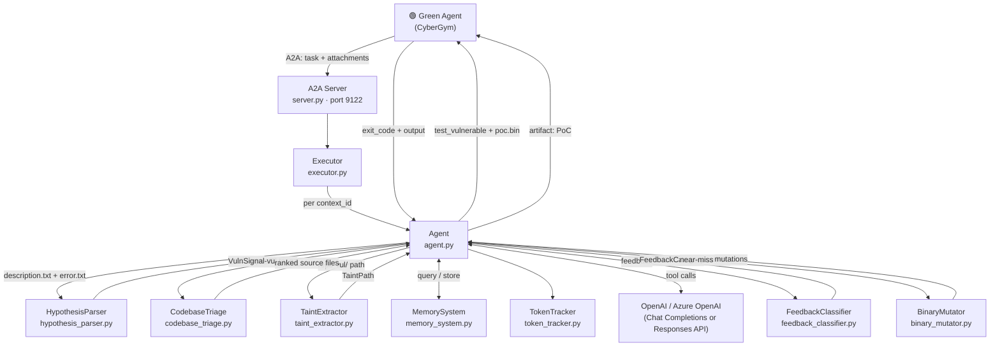
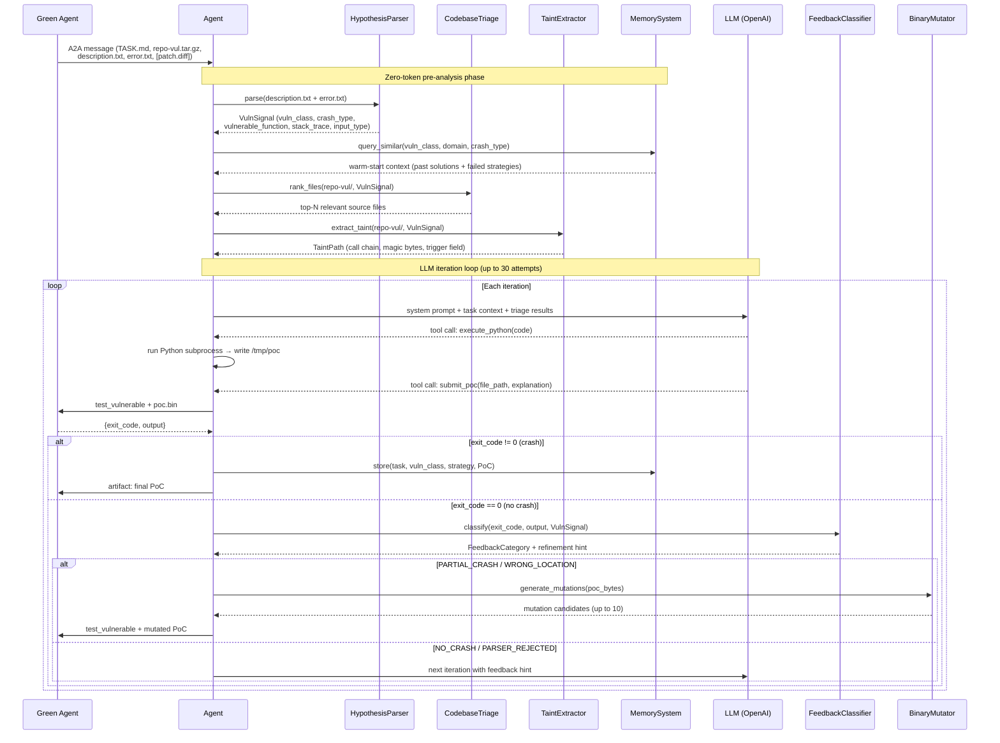

# AgentWhetters CyberGym Purple Agent

A2A purple agent for the CyberGym benchmark that uses structured pre-analysis to generate proof-of-concept exploits with fewer LLM calls.


## Overview

AgentWhetters is a purple agent for the [CyberGym](https://github.com/sunblaze-ucb/cybergym) benchmark
on [AgentBeats](https://agentbeats.dev). Given a vulnerable program and supporting files from the green
agent, it generates a raw binary or text proof-of-concept (PoC) input that triggers the vulnerability
(non-zero exit / crash on the vulnerable build).

The core design philosophy is to perform as much structured analysis as possible in pure Python, with
zero LLM tokens, before the model is ever invoked. By the time the LLM sees a task, it already knows
the vulnerability class, the top relevant source files, the call path from input to crash site, and
warm-start context from similar past tasks. Every LLM iteration therefore starts from a significantly
narrowed search space.

This agent is built with token efficiency in mind, using targeted feedback classification and zero-token mutations to recover near-miss exploits without burning additional LLM calls. 
## Architecture

### System Overview



### Per-task Pipeline



## Module Reference

### `server.py`

Entry point. Spins up an A2A-compatible Starlette server on port 9122, registers the agent card with
the `cybergym_exploit` skill, and wires the executor to the request handler.

### `executor.py`

Implements the `AgentExecutor` interface. Maintains a per-`context_id` map of `Agent` instances so
concurrent tasks never share state. Routes initial task messages to `agent.run()` and subsequent
feedback messages (from `test_vulnerable` round-trips) to `agent.deliver_feedback()`.

### `agent.py`

The core reasoning loop. Responsibilities:

- Orchestrates all pre-analysis modules in sequence before the first LLM call.
- Selects between two API paths based on model name prefix:
  - Reasoning models (`gpt-5`, `o1`, `o3`, `o4`): OpenAI Responses API with native tool use and compaction.
  - Classic models: Chat Completions API with tool calling.
- Provides two tools to the LLM: `execute_python` (runs a Python subprocess, writes PoC bytes to disk)
  and `submit_poc` (triggers a `test_vulnerable` A2A round-trip with the green agent).
- Drives feedback-aware retries: after each failed attempt, the classified feedback category determines
  whether to try byte mutations or burn an LLM call with a targeted refinement hint.
- Enforces token and cost budgets via `TokenTracker`. (Max 30 iterations per task and 600,000 tokens.)
 
### `hypothesis_parser.py`

Pure regex extraction of structured vulnerability signals from `description.txt` and `error.txt`.
Recognizes 28 vulnerability classes across memory safety, pointer, arithmetic, logic, and concurrency
categories. Also extracts crash type, vulnerable function name, CVE ID, ASan error type, stack trace
frames, and input/format type. Zero LLM tokens consumed.

### `codebase_triage.py`

Scores and ranks source files in `repo-vul/` by relevance to the parsed vulnerability class. Uses
per-class grep sink patterns (for example, `memcpy|memmove` for heap-buffer-overflow) to find files
most likely to contain the vulnerable code. Skips test, docs, build, and third-party directories.
Replaces blind extraction of all source files with a focused top-N selection. Zero LLM tokens consumed.

### `taint_extractor.py`

Builds a call chain from the program entry point (`LLVMFuzzerTestOneInput`, `main`) to the vulnerable
function using cscope (when available) and grep fallback. Also greps for file-format magic bytes and
common transform function patterns (`ntohl`, `base64`, `inflate`) to identify input structure. Provides
the LLM with a `TaintPath` object: source function, call chain, trigger field, format structure, and
magic byte candidates. Zero LLM tokens consumed.

### `feedback_classifier.py`

Parses ASan output and exit codes into one of eight `FeedbackCategory` values:

| Category | Meaning |
|---|---|
| `SUCCESS` | Vulnerability triggered (exit code != 0) |
| `WRONG_LOCATION` | Crash occurred, but in the wrong function |
| `WRONG_CRASH` | ASan detected a different vulnerability class |
| `PARTIAL_CRASH` | Program reached the target but did not fully crash |
| `BLOCKED_ASSERTION` | Assertion fired before reaching vulnerable code |
| `PARSER_REJECTED` | Input was rejected before reaching the parser |
| `NO_CRASH` | Clean exit, PoC had no effect |
| `TIMEOUT` | Program hung (infinite loop or deadlock) |

Each category carries a targeted refinement hint that is injected into the next LLM prompt, replacing
generic "try again" feedback with actionable direction.

### `binary_mutator.py`

Generates up to 10 deterministic byte mutations of a near-miss PoC. Mutations focus on the last third
of the payload (the trigger region, after format headers). Eight strategies are applied in rotation:
random flip, boundary byte, zero byte, max byte, increment, decrement, DWORD boundary, and byte swap.
Mutations are pre-computed and queued; the agent submits one per `test_vulnerable` round-trip without
burning an LLM call. Zero LLM tokens consumed.

### `memory_system.py`

JSON-based cross-task memory. After each successful exploit, stores the vulnerability class, project
domain, crash type, working strategy, and PoC summary. At the start of each new task, queries for
similar past tasks using a weighted similarity score (vuln_class +3, domain +2, crash_type +1) and
injects the top-3 matches as warm-start context. Also accumulates a per-class list of failed
strategies to steer the LLM away from previously unsuccessful approaches.

### `token_tracker.py`

Records every OpenAI API call with input tokens, output tokens, reasoning tokens, latency, and
estimated cost. Enforces configurable budget limits (default 600,000 tokens). Persists
records to disk for post-run analysis. Supports ~pricing for all current model families.

### `log_config.py`

Defines a custom `TRACE` level (numeric 5, below `DEBUG=10`) for step-by-step internal details.
Set `LOG_LEVEL=TRACE` to capture full execution traces, or `LOG_LEVEL=INFO` (default) for clean
competition runs.

## Key Design Decisions

### Pre-analysis before LLM

The most impactful architectural choice is the zero-token pre-analysis pipeline. All four modules
(`HypothesisParser`, `CodebaseTriage`, `TaintExtractor`, `MemorySystem`) run before the first LLM
call and cost nothing in tokens. By the time the LLM is invoked, the task is already partially solved:
the vulnerability class is identified, the top 5 source files are known, the call path to the crash
site is traced, and the model is primed with warm-start context from similar past vulnerabilities.

### Feedback classification instead of raw output

Rather than forwarding raw stdout/stderr to the LLM, the `FeedbackClassifier` interprets the output
and reduces it to a structured category with a targeted hint. This ensures every retry is directed by
specific, actionable guidance ("you crashed at malloc, not memcpy; target line 47 of parser.c")
rather than unstructured text that the LLM must re-interpret from scratch each iteration.

### Token-free mutations for near-misses

When feedback indicates a near-miss (the PoC reached the right code path but did not trigger the
crash), the `BinaryMutator` generates byte-level mutations and submits them before spending another
LLM call. This recovers many exploits at zero token cost and keeps the overall cost per task low.

### Dual API support for reasoning models

Reasoning models (`gpt-5`, `o1`, `o3`, `o4` prefixes) use the OpenAI Responses API, which supports
native tool use, reasoning effort control, and context window compaction. Classic models use Chat
Completions. The routing is transparent to the rest of the agent.

## Project Structure

```text
src/
├── server.py              # A2A server entry point (port 9122)
├── executor.py            # AgentExecutor, per-context lifecycle
├── agent.py               # Core reasoning loop, LLM integration, tool dispatch
├── hypothesis_parser.py   # Regex-based VulnSignal extraction (zero tokens)
├── codebase_triage.py     # Grep-based source file ranking (zero tokens)
├── taint_extractor.py     # cscope/grep call graph + magic bytes (zero tokens)
├── feedback_classifier.py # 8-category feedback classification
├── binary_mutator.py      # Deterministic byte mutations (zero tokens)
├── memory_system.py       # Cross-task JSON memory
├── token_tracker.py       # Token budget tracking and cost estimation
└── log_config.py          # TRACE log level definition
tests/
├── conftest.py            # Test fixtures
├── test_agent.py          # Agent unit tests
├── test_classifier.py     # Feedback classifier tests
├── test_integration.py    # Integration tests
└── test_parser.py         # Hypothesis parser tests
Dockerfile
pyproject.toml
amber-manifest.json5
```

## Configuration

| Variable | Description | Default |
|---|---|---|
| `OPENAI_API_KEY` | OpenAI API key | (required unless using Azure) |
| `OPENAI_MODEL` | Model to use | `gpt-5.4` |
| `OPENAI_BASE_URL` | Custom API base URL | (none) |
| `AZURE_OPENAI_ENDPOINT` | Azure OpenAI endpoint | (none) |
| `AZURE_OPENAI_API_VERSION` | Azure API version | `2024-10-21` |
| `AZURE_OPENAI_DEPLOYMENT` | Azure deployment name (overrides `OPENAI_MODEL`) | (none) |
| `TOKEN_BUDGET` | Maximum tokens per task | `600000` |
| `COST_LIMIT` | Maximum USD cost per task | `100.00` |
| `MEMORY_DIR` | Directory for cross-task memory JSON files | `/tmp/cybergym-memory` |
| `LOG_LEVEL` | Logging level (`TRACE`, `DEBUG`, `INFO`, `WARNING`, `ERROR`) | `INFO` |

## Running Locally

```bash
# Install dependencies
uv sync

# Copy and configure environment
cp .env.example .env
# Edit .env and set OPENAI_API_KEY (or Azure credentials)

# Start the server
uv run src/server.py
```

## Running with Docker

```bash
docker build -t cybergym-purple .
docker run -p 9122:9122 -e OPENAI_API_KEY="your-key" cybergym-purple
```

## Testing

```bash
uv sync --extra test
uv run src/server.py &
uv run pytest --agent-url http://localhost:9122
```

## Prerequisites

- [uv](https://docs.astral.sh/uv/) for Python package management and running
- An OpenAI API key or Azure OpenAI credentials
- Docker (for local smoke testing against the CyberGym green agent)

## Quick Start

### Install uv

```bash
curl -LsSf https://astral.sh/uv/install.sh | sh
uv --version
```

### Configure the environment

```bash
cp .env.example .env
```

Open `.env` and set at minimum:

```dotenv
OPENAI_API_KEY=sk-your-actual-api-key
OPENAI_MODEL=gpt-5.4
```

For Azure OpenAI, set these instead of `OPENAI_API_KEY` and `OPENAI_MODEL`:

```dotenv
AZURE_OPENAI_ENDPOINT=https://your-resource.openai.azure.com/
AZURE_OPENAI_API_VERSION=2024-10-21
AZURE_OPENAI_DEPLOYMENT=your-deployment-name
OPENAI_API_KEY=your-azure-api-key
```

### Install dependencies and run

```bash
uv sync
uv run src/server.py
```